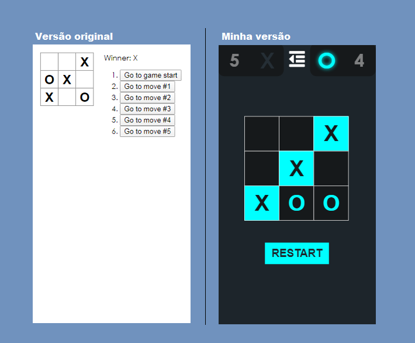

<div align="center">
    :video_game: <h1> Tic Tac Toe</h1>


<p>
    O joginho Tic Tac Toe criado a partir do tutorial do ReactJS com algumas alterações no design e fucionalidades adicionais. Desenvolvido com ReactJS.
</p>



</div>


## :open_book: Alterações

Eu implementei no código do Tic Tac Toe algumas funções. Ex:

* Design mais atraente e confortável
* Contagem de pontos dos jogadores
* Função de mostrar o proximo jogador de forma dinâmica e etc..

## :dart: Como usar

Você pode acessar a aplicação neste link [aqui](https://wizardly-shannon-8e5991.netlify.app/)

Caso queira rodar rodar o game em sua maquina, basta abrir uma janela do seu terminal(bash/cmd/powershell) e executar o seguintes comandos abaixo.

Obs: Para rodar a aplicação localmente é necessário ter instalado o [Node.js](https://nodejs.org/en/download/)

```shell
# primeiro clone este repositório
git clone https://github.com/jefferson-calmon/tic-tac-toe_react.git

# Depois entre na pasta do projeto
cd tic-tac-toe_react

# Agora será necessário instalar as dependencias do projeto
npm install react

npm install react-dom

```

Pronto agora basta iniciar o projeto. Para isto execute:

```shell
npm start
```

## :scroll: License

Este repositório ultiliza a MIT license. Por favor leia a licensa.

Feito com :heart: por [Jefferson Ferrari](https://www.linkedin.com/in/jefferson-f-b24248191/)